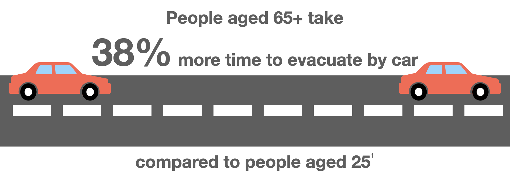

<html>  
  <body>
  <h1>Why Should We Incorporate Social Factors Into Evacuation Planning?</h1>

While evacuation planning typically measures risk by using traditional biophysical indicators, such as fuel, weather and geography, it does not factor in the different risks that different people may face. Research has shown that socially vulnerable populations tend to be at a higher risk when responding to and recovering from wildfires. We determine social vulnerability by factors such as age, income, education, and health.

<h2>How Social Factors Affect Evacuations</h2>

Socially vulnerable populations can face additional difficulties when evacuting from wildfires. Here, we look at old age as an example.

The elderly are also more at risk of perishing from wildfires.

<h2>How Social Factors Affect Damage and Recovery from Wildfires</h2>

Socially vulnerable populations also face higher risks of damage from wildfires and can have less ability to recover from said damages.

More than 80% of older homes (houses built prior to 2008) and mobile homes were destroyed in the Camp Fire, compared to the 49% of newer homes that were burnt down.

<h2>How are Evacuations Currently Planned?</h2>

Primarily based on biophysical indicators, such as WHP. (Show WHP Map)
  
  </body>
  
</html>

