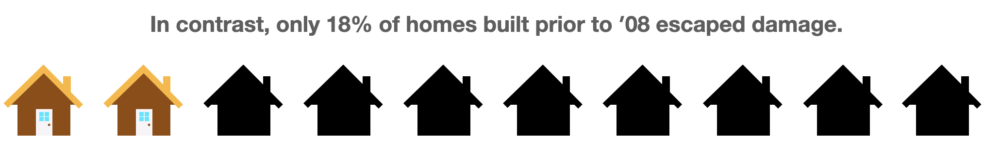
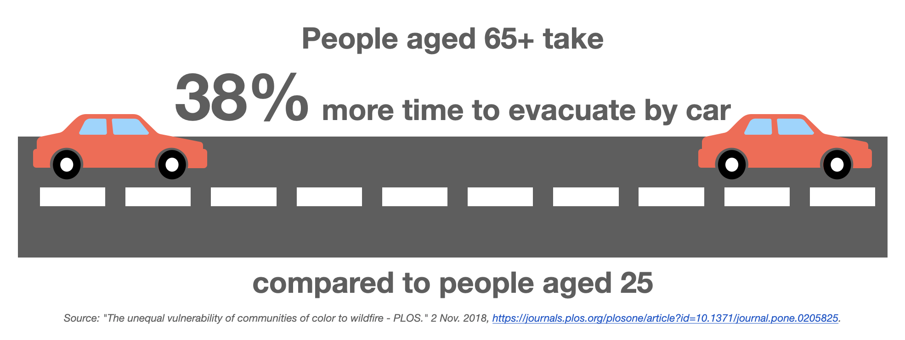
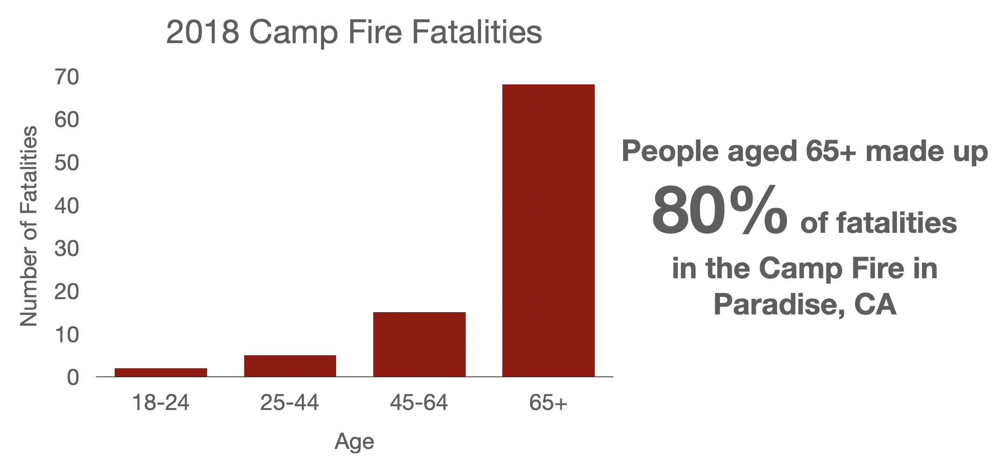

<html>  
  <body>
  <h1>Why Should We Incorporate Social Factors Into Wildfire Risk Assessments?</h1>

While wildfire risk assessments typically rely on traditional biophysical indicators, such as fuel, weather and geography, they does not consider the effects of social factors. This leaves socially vulnerable populations to be potentially underserved when it comes to protection, response, and recovery from wildfires.

<b>How do we define social factors?</b>

Social factors include demographic and socieconomic characteristics including (but not limited to):

<ul>
  <li>Age</li>
  <li>Income</li>
  <li>Ethnicity</li>
  <li>Education Level</li>
  <li>Disability Status</li>
</ul>

<h2>Examples of how Social Factors Affect Wildfire Response and Recovery</h2>

 
 

 
 
 

 
 
 

 
 
 

 
 
 

<h2>How can we Incorporate Social Factors into Wildfire Risk?</h2>

Research conducted by Davies et al. proposes that a measure of a population's adaptive capacity be combined with traditional wildfire risk indicators to assess overall vulnerability.

<h3>Social Factors Relating to Adaptive Capacity</h3>

Adaptive Capacity combines metrics such as income, number in poverity, education levels, and language proficiency. We can see that overall vulnerability, or the ability to respond to and recover from wildfires, has significanct relationships with these factors.

<noscript></noscript><object class='tableauViz'  style='display:none;'><param name='host_url' value='https%3A%2F%2Fpublic.tableau.com%2F' /> <param name='embed_code_version' value='3' /> <param name='site_root' value='' /><param name='name' value='Vulnerabilityvs_SocialFactors&#47;Vulnerabilityvs_SocialFactors' /><param name='tabs' value='no' /><param name='toolbar' value='yes' /><param name='static_image' value='https:&#47;&#47;public.tableau.com&#47;static&#47;images&#47;Vu&#47;Vulnerabilityvs_SocialFactors&#47;Vulnerabilityvs_SocialFactors&#47;1.png' /> <param name='animate_transition' value='yes' /><param name='display_static_image' value='yes' /><param name='display_spinner' value='yes' /><param name='display_overlay' value='yes' /><param name='display_count' value='yes' /><param name='language' value='en' /><param name='filter' value='publish=yes' /></object>
                

<h3>Incorporating Adaptive Capacity into Wildfire Vulnerability</h3>

Accounting for a region's adaptive capacity complicates traditional assessments of risk. For example, the WHP indices for Marin, Sonoma, Napa, and Lake counties indicate moderate to high wildfire vulnerability based on biophysical indicators.
 

Examining these counties through the lens of adaptive capacity, however, shows that 3 of the 4 counties appear to be more resilient to disaster. The overall vulnerability of these 3 counties is thus tempered by their perceived abiity to prepare for and recover from wildfire. In the case of Lake County, accounting for adaptive capacity shows an increased risk of disaster as a result of fire.

<noscript></noscript><object class='tableauViz'  style='display:none;'><param name='host_url' value='https%3A%2F%2Fpublic.tableau.com%2F' /> <param name='embed_code_version' value='3' /> <param name='site_root' value='' /><param name='name' value='CountyComparisons_16198323295900&#47;WHPvsACbyCounty' /><param name='tabs' value='no' /><param name='toolbar' value='yes' /><param name='static_image' value='https:&#47;&#47;public.tableau.com&#47;static&#47;images&#47;Co&#47;CountyComparisons_16198323295900&#47;WHPvsACbyCounty&#47;1.png' /> <param name='animate_transition' value='yes' /><param name='display_static_image' value='yes' /><param name='display_spinner' value='yes' /><param name='display_overlay' value='yes' /><param name='display_count' value='yes' /><param name='language' value='en' /><param name='filter' value='publish=yes' /></object>
                

Examining risk on a more local scale, by census tract, can also reveal unexpected vulnerabilities.
 

Within Marin County, which appears to have a strong adaptive capacity, pockets of greater vulnerability still exist. Identifying these communities and helping them respond to wildfires will be an important part of readying regions for a future of in which fire becomes an increasing part of the landscape.

<noscript></noscript><object class='tableauViz'  style='display:none;'><param name='host_url' value='https%3A%2F%2Fpublic.tableau.com%2F' /> <param name='embed_code_version' value='3' /> <param name='site_root' value='' /><param name='name' value='CensusTractComparisons&#47;CensusTractComparisons' /><param name='tabs' value='no' /><param name='toolbar' value='yes' /><param name='static_image' value='https:&#47;&#47;public.tableau.com&#47;static&#47;images&#47;Ce&#47;CensusTractComparisons&#47;CensusTractComparisons&#47;1.png' /> <param name='animate_transition' value='yes' /><param name='display_static_image' value='yes' /><param name='display_spinner' value='yes' /><param name='display_overlay' value='yes' /><param name='display_count' value='yes' /><param name='language' value='en' /><param name='filter' value='publish=yes' /></object>
                

<h3>Statewide Map of Risk Factors</h3> 

Wildfire Hazard Potential: Risk of wildfires by biophysical indicators. Red regions are more likely to experience wildfires.

Adaptive Capacity: The ability of people to respond to and recover from wildfires. Red regions (higher values) are less adaptable to wildfires.

Overall Vulnerability: Vulnerability to wildfires when combining WHP and Adaptive Capacity.

<noscript></noscript><object class='tableauViz'  style='display:none;'><param name='host_url' value='https%3A%2F%2Fpublic.tableau.com%2F' /> <param name='embed_code_version' value='3' /> <param name='path' value='shared&#47;585MJMG6P' /> <param name='toolbar' value='yes' /><param name='static_image' value='https:&#47;&#47;public.tableau.com&#47;static&#47;images&#47;58&#47;585MJMG6P&#47;1.png' /> <param name='animate_transition' value='yes' /><param name='display_static_image' value='yes' /><param name='display_spinner' value='yes' /><param name='display_overlay' value='yes' /><param name='display_count' value='yes' /><param name='language' value='en' /><param name='filter' value='publish=yes' /></object>
                

<h3></h3> 

  </body>
  
</html>

