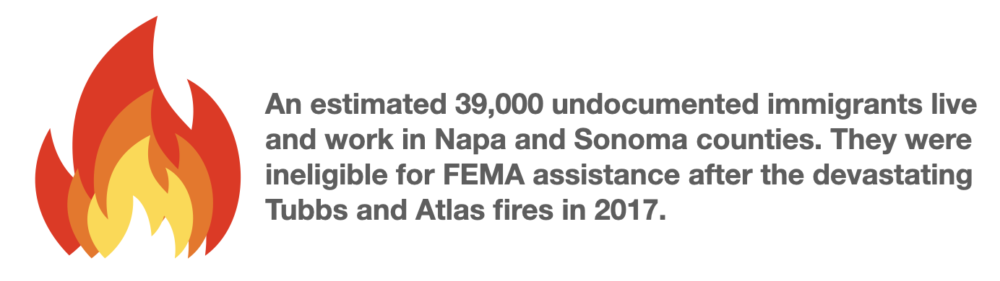

<html>  
  <body>
  <h1>Why Should We Incorporate Social Factors Into Wildfire Evacuation Planning?</h1>

While wildfire evacuation planning typically measures risk by using traditional biophysical indicators, such as fuel, weather and geography, it does not factor in the different risks that different people may face.

Research has shown that socially vulnerable populations tend to be at a higher risk when responding to and recovering from wildfires. We determine social vulnerability by factors such as age, income, education, and health.

<h2>How Social Factors Affect Evacuations</h2>

Socially vulnerable populations can face additional difficulties when evacuting from wildfires. Here, we look at old age as an example.

The elderly are also more at risk of perishing from wildfires.

<h2>How Social Factors Affect Damage and Recovery from Wildfires</h2>

Socially vulnerable populations also face higher risks of damage from wildfires and can have less ability to recover from said damages.

<h2>What Areas are Vulnerable?</h2>

1. Map of Wildfire Hazard Potential (WHP): Risk of wildfires by biophysical indicators. Red regions are more likely to experience wildfires.

<noscript></noscript><object class='tableauViz'  style='display:none;'><param name='host_url' value='https%3A%2F%2Fpublic.tableau.com%2F' /> <param name='embed_code_version' value='3' /> <param name='site_root' value='' /><param name='name' value='SVIVisualizationsFinal_16188538726050&#47;WildfireRisk' /><param name='tabs' value='no' /><param name='toolbar' value='yes' /><param name='static_image' value='https:&#47;&#47;public.tableau.com&#47;static&#47;images&#47;SV&#47;SVIVisualizationsFinal_16188538726050&#47;WildfireRisk&#47;1.png' /> <param name='animate_transition' value='yes' /><param name='display_static_image' value='yes' /><param name='display_spinner' value='yes' /><param name='display_overlay' value='yes' /><param name='display_count' value='yes' /><param name='language' value='en' /></object>
                
  

2. Map of Adaptive Capacity: The ability of people to respond to and recover from wildfires. Red regions (higher values) are less adaptable to wildfires.

3. Map of Overall Vulnerability: Vulnerability to wildfires when combining WHP and Adaptive Capacity.

  </body>
  
</html>

