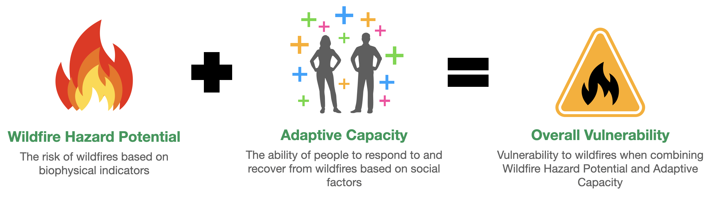

<html>  
  <body>
  <h1>Why Should We Incorporate Social Factors Into Wildfire Risk Assessments?</h1>

While wildfire risk assessments typically rely on traditional biophysical indicators, such as fuel, weather and geography, they does not consider the effects of social factors. This leaves socially vulnerable populations to be potentially underserved when it comes to protection, response, and recovery from wildfires.

<b>How do we define social factors?</b> Social factors include demographic and socieconomic characteristics including (but not limited to):

<ul>
  <li>Age</li>
  <li>Income</li>
  <li>Ethnicity</li>
  <li>Education Level</li>
  <li>Disability Status</li>
</ul>

<h2>Examples of how Social Factors Affect Wildfire Response and Recovery</h2>

 
 

 
 
 

 
 

 
 

 
 

 

 

<h2>How can we Incorporate Social Factors into Wildfire Risk?</h2>

<a href="https://journals.plos.org/plosone/article?id=10.1371/journal.pone.0205825">Research by Davies et al.</a> proposes a new measure of wildfire vulnerability that combines biophysical indicators with social factors.

<h3>Example Case Study: Lake, Marin, Sonoma, and Napa Counties</h3>

This chart shows Wildfire Hazard Potential (WHP), Adaptive Capacity, and Overall Vulnerability for Lake, Marin, Sonoma, and Napa Counties in relation to the other counties in California. Try selecting different risk metrics to see how these counties' risk levels change. You can also explore other counties of interest.

<noscript></noscript><object class='tableauViz'  style='display:none;'><param name='host_url' value='https%3A%2F%2Fpublic.tableau.com%2F' /> <param name='embed_code_version' value='3' /> <param name='site_root' value='' /><param name='name' value='RiskMetricsbyCounty&#47;RiskMetricsbyCountyDB' /><param name='tabs' value='no' /><param name='toolbar' value='yes' /><param name='static_image' value='https:&#47;&#47;public.tableau.com&#47;static&#47;images&#47;Ri&#47;RiskMetricsbyCounty&#47;RiskMetricsbyCountyDB&#47;1.png' /> <param name='animate_transition' value='yes' /><param name='display_static_image' value='yes' /><param name='display_spinner' value='yes' /><param name='display_overlay' value='yes' /><param name='display_count' value='yes' /><param name='language' value='en' /><param name='filter' value='publish=yes' /></object>
                

Looking specifically at Lake, Sonoma, Napa, and Marin counties, we can see that Lake County's wildfire risk is magnified by poor adaptive capacity, while the remaining counties' wildfire risks are tempered by greater social resilience.
 

<h3>Digging Deeper: Census Tracts in Marin County</h3>

We can zoom further into Marin County, which appears to have a strong adaptive capacity, and find that <b>pockets of vulnerability still exist.</b> In this case, we find such pockets at the census tract level.
 

<noscript></noscript><object class='tableauViz'  style='display:none;'><param name='host_url' value='https%3A%2F%2Fpublic.tableau.com%2F' /> <param name='embed_code_version' value='3' /> <param name='site_root' value='' /><param name='name' value='CensusTractComparisons&#47;CensusTractComparisons' /><param name='tabs' value='no' /><param name='toolbar' value='yes' /><param name='static_image' value='https:&#47;&#47;public.tableau.com&#47;static&#47;images&#47;Ce&#47;CensusTractComparisons&#47;CensusTractComparisons&#47;1.png' /> <param name='animate_transition' value='yes' /><param name='display_static_image' value='yes' /><param name='display_spinner' value='yes' /><param name='display_overlay' value='yes' /><param name='display_count' value='yes' /><param name='language' value='en' /><param name='filter' value='publish=yes' /></object>
                

Identifying these communities and helping them respond to wildfires will be an important part of readying regions for a future of in which fire becomes an increasing part of the landscape.

<h3>Explore Wildfire Risk, Adaptive Capacity, and Overall Vulnerability Across CA</h3> 

You can use this map to explore how vulnerable different counties and census tracts are to wildfires.

Select which index you want to explore using the dropdown. Click onto a specific county on the lefthand side to view a breakdown at the census tract level.

<noscript></noscript><object class='tableauViz'  style='display:none;'><param name='host_url' value='https%3A%2F%2Fpublic.tableau.com%2F' /> <param name='embed_code_version' value='3' /> <param name='path' value='shared&#47;585MJMG6P' /> <param name='toolbar' value='yes' /><param name='static_image' value='https:&#47;&#47;public.tableau.com&#47;static&#47;images&#47;58&#47;585MJMG6P&#47;1.png' /> <param name='animate_transition' value='yes' /><param name='display_static_image' value='yes' /><param name='display_spinner' value='yes' /><param name='display_overlay' value='yes' /><param name='display_count' value='yes' /><param name='language' value='en' /><param name='filter' value='publish=yes' /></object>
                

<h3></h3> 

  </body>
  
</html>

